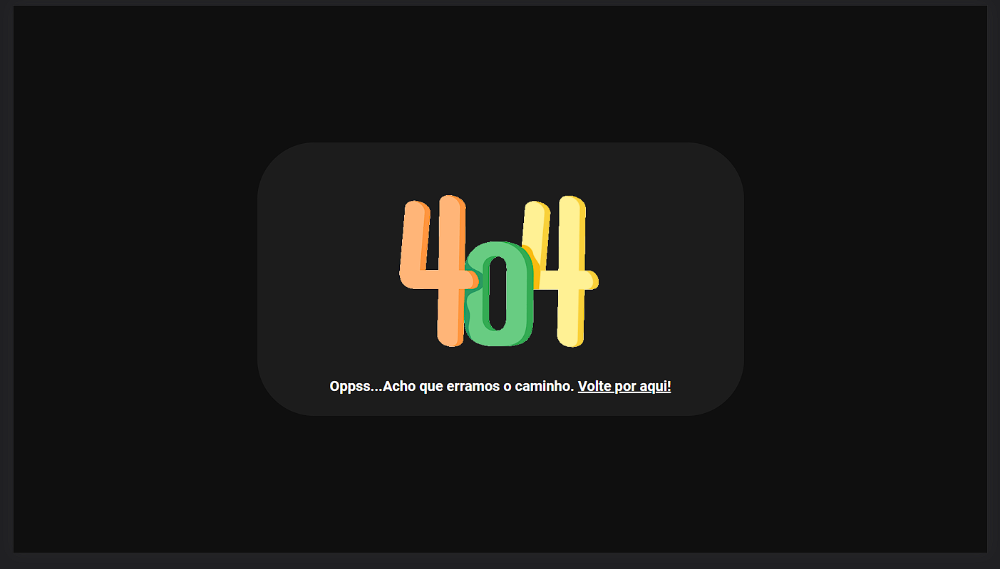

# Front-end EWZ

###  Responsive frontend application, developed with ReactJs and Styled-Components, which consumes an API with user data.

### - Deploy link: https://frontend-ewz.netlify.app
---
### Preview: 

---

## Error page, if the user enters a route that does not exist: 

## Dependencies: 

- **axios**
- **react-spinners**
- **react-router-dom**
----
## Dev dependencies

- **styled-components**